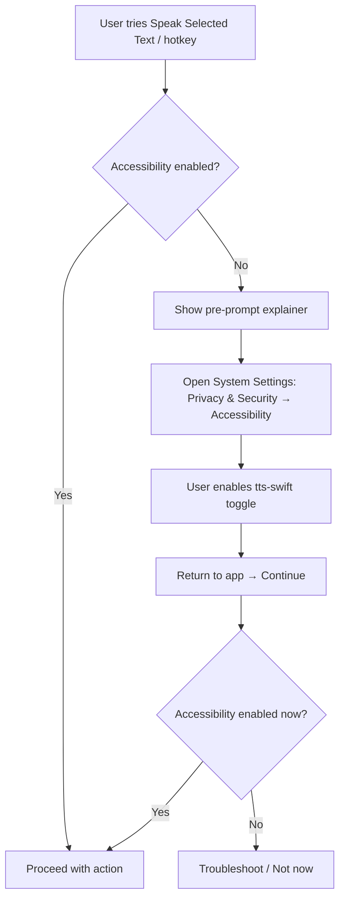
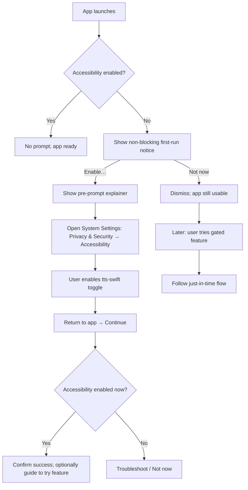

# Feature: Accessibility Permissions UX

## Context

The MVP checklist includes: **“Prompt user for accessibility permissions on startup.”**

This app needs macOS **Accessibility** permission to power features like **global hotkeys** and **reading selected text from other apps**. macOS does not allow apps to programmatically grant this permission; users must explicitly enable it in **System Settings**.

Goal of this doc: define the **best UX** for prompting users and getting them to the right System Settings page with minimal confusion and minimal “nagging”.

## UX Principles (macOS Privacy / Permission Requests)

- **Just-in-time (preferred):** Ask when the user tries to use a feature that requires Accessibility, not immediately on first launch.
- **Make the request obviously connected to the user’s action:** the user should understand *why now*.
- **Be explicit about what will and won’t happen:** the app can’t enable the toggle for them.
- **Provide a direct path to the exact Settings pane** and a clear “return and try again” loop.
- **Don’t block the app unnecessarily:** offer “Not now” while keeping the rest usable.

## Recommended Permission Prompt Flow

### Diagrams

#### Just-in-time (recommended) flow



#### First-run (optional) flow (for MVP “prompt on startup” interpretation)



### Comparison: Just-in-time vs first-run

| Dimension | Just-in-time (recommended) | First-run notice (optional) |
|---|---|---|
| Trigger | User attempts a feature that needs Accessibility | App launch (only if not enabled) |
| User intent | High (they’re trying to do the thing) | Medium/low (they may not know why yet) |
| Disruption | Lower; feels connected to action | Higher; can feel like “setup friction” |
| Conversion likelihood | Typically higher | Typically lower |
| Risk of “nagging” | Lower if only shown when needed | Higher unless strictly rate-limited |
| Best use | Primary UX for permission gating | Supplemental: introduce requirement early without forcing a system prompt |

### 1) Trigger moment (when to prompt)

**Preferred trigger:** when the user initiates a feature that requires Accessibility.

Examples:
- Presses the global hotkey for “Speak Selected Text”
- Clicks menu item “Speak Selected Text”
- Enables a setting that depends on Accessibility (e.g., “Read selected text from any app”)

**If MVP requires prompting on startup:** do **not** immediately trigger the system permission prompt. Instead:
- Show a non-blocking, first-run notice (banner/callout) explaining that Accessibility will be required for “Speak Selected Text”, with a button to enable.
- Only show the system prompt after the user clicks “Enable” (explicit intent).

### 2) Pre-prompt explanation (our UI)

Before invoking the macOS system prompt, show a small custom dialog/sheet that:

- Names the feature the user just tried to use
- Explains why Accessibility is needed
- Provides two choices:
  - Primary: **Enable in System Settings…**
  - Secondary: **Not now**

#### Suggested copy (dialog)

**Title:** Enable Accessibility Access

**Body:**
“To speak selected text from other apps, tts-swift needs Accessibility access.

This allows tts-swift to read your current selection when you use the hotkey or menu command. You can turn this on in System Settings.”

**Buttons:**
- “Open System Settings” (primary)
- “Not now” (secondary)

### 3) Open the correct System Settings pane

When the user clicks “Open System Settings”, deep-link to:

- `x-apple.systempreferences:com.apple.preference.security?Privacy_Accessibility`

Notes:
- This opens **System Settings → Privacy & Security → Accessibility** on modern macOS.
- If deep-link fails for any reason, provide fallback instructions: “Open System Settings → Privacy & Security → Accessibility”.

### 4) In-Settings instructions (in our UI)

After opening System Settings, keep a lightweight “helper” state in the app:

- Show a small sheet/window with step-by-step instructions:
  1. Find “tts-swift” in the list
  2. Toggle it ON
  3. Return to tts-swift and click “Continue”

Include:
- **Continue** (re-check permission)
- **I don’t see tts-swift** (expands troubleshooting)

### 5) Post-return verification and success state

On “Continue”, re-check permission status.

- If granted: show a brief success confirmation (“Accessibility enabled — you’re all set”) and proceed with the user’s original action (if possible).
- If still not granted: keep the helper open, but avoid re-showing the macOS prompt repeatedly.

## Edge Cases & Troubleshooting UX

### User denies / closes the prompt

- Treat as “Not now”.
- The feature that requires Accessibility should show a friendly inline error:
  - “Accessibility access is required to read selected text from other apps.”
  - CTA: “Enable…”

### App not visible in Accessibility list

Common causes:
- The user hasn’t triggered the system trust prompt yet.
- Development builds change identity frequently (signing / bundle id changes).

UX handling:
- Provide instructions:
  - “If you don’t see tts-swift, click the ‘+’ button and add it from Applications.”
- If the app is not in `/Applications` (dev builds), suggest:
  - “Move the app to Applications and reopen it.”

### Avoiding repeated nagging

- If the user clicks “Not now”, don’t re-prompt on every app launch.
- Re-prompt only:
  - when they attempt the gated feature again, or
  - from a dedicated Settings section (“Permissions”) with a clear “Enable Accessibility” button.

## UX Placement Recommendations

### A) Settings screen (always-available)

Add a “Permissions” section with:
- Current status: “Accessibility: Enabled/Not enabled”
- Button: “Open System Settings”
- Short explanation

This acts as a discoverable, non-invasive place to manage permissions.

### B) First-run experience (optional)

A small callout on first launch:
- “Enable Accessibility to use Speak Selected Text from other apps.”
- Button: “Enable…”
- Link: “Learn more” (opens this doc’s instructions in-app or a help screen)

Avoid hard-blocking the whole app on first run.

## Code examples (Swift)

These are intentionally small, copy-pastable snippets to clarify how the UX flow maps to code.

### 1) Check status (no prompt)

```swift
import ApplicationServices

func hasAccessibilityPermission() -> Bool {
    AXIsProcessTrusted()
}
```

### 2) Trigger the system prompt (only after explicit user intent)

This can show the macOS “enable in System Settings” prompt, but the user still must manually toggle access.

```swift
import ApplicationServices

func requestAccessibilityPermissionViaSystemPrompt() -> Bool {
    let options =
        [kAXTrustedCheckOptionPrompt.takeUnretainedValue() as String: true] as CFDictionary
    return AXIsProcessTrustedWithOptions(options)
}
```

### 3) Open System Settings → Accessibility directly

```swift
import AppKit

func openAccessibilityPrivacySettings() {
    guard let url = URL(
        string: "x-apple.systempreferences:com.apple.preference.security?Privacy_Accessibility"
    ) else {
        return
    }

    NSWorkspace.shared.open(url)
}
```

### 4) “Return and verify” loop (re-check on Continue)

```swift
import ApplicationServices

@MainActor
final class AccessibilityPermissionModel: ObservableObject {
    @Published private(set) var isTrusted = AXIsProcessTrusted()

    func refresh() {
        isTrusted = AXIsProcessTrusted()
    }
}
```

Usage idea:
- “Open System Settings” → `openAccessibilityPrivacySettings()`
- “Continue” → `model.refresh()` and proceed if `model.isTrusted`

### 5) Gate a feature just-in-time (recommended)

```swift
@MainActor
func speakSelectedTextJustInTime() {
    guard AXIsProcessTrusted() else {
        // Present your explainer UI/sheet instead of firing the system prompt immediately.
        // After user chooses “Open System Settings”, call openAccessibilityPrivacySettings().
        return
    }

    // Proceed with reading selection + speaking.
}
```

### 6) Rate-limit first-run notices (optional)

```swift
struct AccessibilityNoticePolicy {
    static let lastDismissedKey = "accessibility_notice_last_dismissed"

    static func markDismissed(now: Date = Date()) {
        UserDefaults.standard.set(now, forKey: lastDismissedKey)
    }

    static func shouldShow(now: Date = Date(), coolDownDays: Int = 7) -> Bool {
        guard let last = UserDefaults.standard.object(forKey: lastDismissedKey) as? Date else {
            return true
        }

        let days = Calendar.current.dateComponents([.day], from: last, to: now).day ?? 0
        return days >= coolDownDays
    }
}
```

Note: unlike some macOS permissions, the Accessibility trust prompt does not include a developer-provided “usage description” string.

## Implementation Notes (for product/design decisions)

- The system can only *ask* and *send the user to Settings*; it cannot flip the toggle.
- The best experience comes from **pairing a clear pre-prompt explanation** with a **direct Settings deep-link** and an **in-app “return and verify” loop**.
- For reference:
  - AXIsProcessTrustedWithOptions (Apple API): https://developer.apple.com/documentation/applicationservices/1459186-axisprocesstrustedwithoptions
  - Apple Support: Allow accessibility apps to access your Mac: https://support.apple.com/guide/mac-help/mh43185/mac
  - Apple HIG on privacy: https://developer.apple.com/design/human-interface-guidelines/privacy
  - Apple Developer Forums (deep-link discussion): https://developer.apple.com/forums/thread/709289
  - macOS Settings deep links reference (community): https://macmost.com/mac-settings-links
